# 📁 Estrutura de Pastas

[← Voltar ao README principal](../README.md)

---

## 🗂️ Diagrama da Estrutura

```mermaid
graph TD
    ROOT["📦 projeto-raiz/"]

    ROOT --> DOCS["📂 docs/"]
    ROOT --> APP["📂 app/"]
    ROOT --> TESTS["📂 tests/"]
    ROOT --> DOCKER["📂 docker/"]
    ROOT --> FILES["📄 Arquivos de Configuração"]

    DOCS --> D1["tecnologias.md"]
    DOCS --> D2["requisitos-funcionais.md"]
    DOCS --> D3["requisitos-nao-funcionais.md"]
    DOCS --> D4["estrutura-pastas.md"]
    DOCS --> D5["scrum-sprints.md"]
    DOCS --> D6["como-executar.md"]

    APP --> BACKEND["📂 backend/"]
    APP --> FRONTEND["📂 frontend/"]

    BACKEND --> B1["📂 routes/"]
    BACKEND --> B2["📂 models/"]
    BACKEND --> B3["📂 services/"]
    BACKEND --> B4["📂 repositories/"]
    BACKEND --> B5["__init__.py"]
    BACKEND --> B6["config.py"]

    B1 --> R1["auth.py"]
    B1 --> R2["main.py"]
    B2 --> M1["user.py"]
    B2 --> M2["item.py"]
    B3 --> S1["auth_service.py"]
    B4 --> REP1["user_repository.py"]

    FRONTEND --> FE1["📂 templates/"]
    FRONTEND --> FE2["📂 static/"]

    FE1 --> T1["base.html"]
    FE1 --> T2["index.html"]
    FE1 --> T3["auth/"]

    FE2 --> ST1["📂 css/"]
    FE2 --> ST2["📂 js/"]
    FE2 --> ST3["📂 img/"]

    TESTS --> TS1["test_routes.py"]
    TESTS --> TS2["test_services.py"]
    TESTS --> TS3["conftest.py"]

    DOCKER --> DK1["Dockerfile"]
    DOCKER --> DK2["nginx.conf"]

    FILES --> F1["README.md"]
    FILES --> F2["pyproject.toml"]
    FILES --> F3["poetry.lock"]
    FILES --> F4["docker-compose.yml"]
    FILES --> F5[".env.example"]
    FILES --> F6[".gitignore"]
    FILES --> F7["wsgi.py"]
```

---

## 📋 Descrição das Pastas

### Raiz do projeto

| Arquivo/Pasta | Descrição |
|---|---|
| `README.md` | Documento principal do repositório |
| `pyproject.toml` | Configuração do projeto e dependências (Poetry) |
| `poetry.lock` | Lock de versões para reprodutibilidade |
| `docker-compose.yml` | Orquestração dos serviços Docker |
| `.env.example` | Modelo de variáveis de ambiente (nunca suba o `.env` real) |
| `.gitignore` | Arquivos ignorados pelo Git |
| `wsgi.py` | Ponto de entrada WSGI para o Gunicorn |

### `app/backend/`

| Pasta | Descrição |
|---|---|
| `routes/` | Blueprints Flask com as rotas da aplicação |
| `models/` | Modelos de dados (ORM ou dataclasses) |
| `services/` | Lógica de negócio desacoplada das rotas |
| `repositories/` | Acesso e abstração ao banco de dados |
| `config.py` | Configurações por ambiente (dev, prod) |
| `__init__.py` | Factory function `create_app()` do Flask |

### `app/frontend/`

| Pasta | Descrição |
|---|---|
| `templates/` | Templates Jinja2 (HTML renderizado no servidor) |
| `static/css/` | Folhas de estilo |
| `static/js/` | Scripts JavaScript |
| `static/img/` | Imagens estáticas |

### `tests/`

| Arquivo | Descrição |
|---|---|
| `conftest.py` | Fixtures compartilhadas do Pytest |
| `test_routes.py` | Testes das rotas HTTP |
| `test_services.py` | Testes unitários dos serviços |

### `docs/`

Documentação completa do projeto. Cada arquivo cobre um tema específico e está linkado no README principal.

### `docker/`

| Arquivo | Descrição |
|---|---|
| `Dockerfile` | Imagem da aplicação Flask + Gunicorn |
| `nginx.conf` | Configuração do proxy reverso (opcional) |

---

[← Voltar ao README principal](../README.md)
