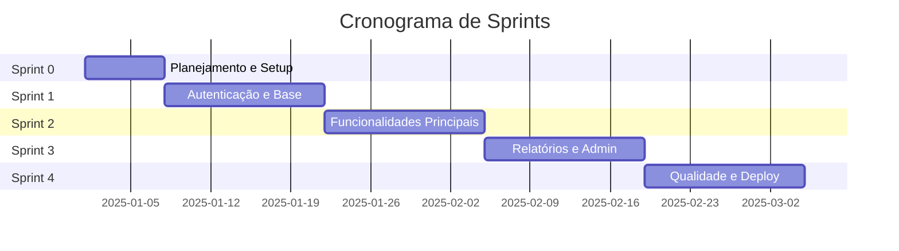

# 🏃 Itinerário SCRUM — Sprints e Histórias de Usuário

[← Voltar ao README principal](../README.md)

---

## 📌 Visão Geral do Processo

---

## 📋 Backlog do Produto (Product Backlog)

| ID | Épico | História | Prioridade | Sprint |
|---|---|---|---|---|
| US01 | Autenticação | Como usuário, quero me cadastrar com e-mail e senha para acessar o sistema. | 🔴 Alta | Sprint 1 |
| US02 | Autenticação | Como usuário, quero fazer login para acessar minhas funcionalidades. | 🔴 Alta | Sprint 1 |
| US03 | Autenticação | Como administrador, quero gerenciar contas de usuários para manter o controle de acesso. | 🔴 Alta | Sprint 1 |
| US04 | Core | Como usuário, quero visualizar a listagem de itens para encontrar o que preciso. | 🔴 Alta | Sprint 2 |
| US05 | Core | Como usuário, quero buscar itens por nome ou categoria para agilizar minha navegação. | 🟡 Média | Sprint 2 |
| US06 | Core | Como usuário, quero ver os detalhes de um item para tomar decisões informadas. | 🟡 Média | Sprint 2 |
| US07 | Admin | Como administrador, quero gerar relatórios por período para análise de dados. | 🟡 Média | Sprint 3 |
| US08 | Admin | Como administrador, quero visualizar logs de acesso para monitorar o uso do sistema. | 🟢 Baixa | Sprint 3 |
| US09 | Qualidade | Como desenvolvedor, quero testes automatizados para garantir a estabilidade do sistema. | 🔴 Alta | Sprint 4 |
| US10 | Deploy | Como time, quero o sistema containerizado com Docker para facilitar o deploy. | 🔴 Alta | Sprint 4 |

---

## 🗓️ Sprint 0 — Setup e Planejamento (1 semana)

**Objetivo:** Preparar o ambiente de desenvolvimento, repositório e ferramentas de gestão.

### Histórias e Tarefas

| Tarefa | Responsável | Status |
|---|---|---|
| Criar repositório no GitHub com estrutura de pastas | Time | 🔲 A fazer |
| Configurar pyproject.toml com Poetry | Time | 🔲 A fazer |
| Criar Dockerfile e docker-compose.yml base | Time | 🔲 A fazer |
| Configurar Trello com colunas: Backlog / Em andamento / Revisão / Concluído | Time | 🔲 A fazer |
| Definir e documentar requisitos funcionais e não funcionais | Time | 🔲 A fazer |
| Criar `.env.example` e `.gitignore` | Time | 🔲 A fazer |

**Critério de Aceite da Sprint:** Repositório funcional com `docker compose up` executando a aplicação Flask em branco.

---

## 🗓️ Sprint 1 — Autenticação e Base (2 semanas)

**Objetivo:** Implementar o sistema de autenticação e a estrutura base da aplicação.

### US01 — Cadastro de Usuário
> *Como usuário, quero me cadastrar com e-mail e senha para acessar o sistema.*

**Critérios de Aceite:**
- [ ] Formulário de cadastro com validação de campos obrigatórios.
- [ ] Senha armazenada com hash (bcrypt/Argon2).
- [ ] Mensagem de erro clara para e-mail já cadastrado.
- [ ] Redirecionamento para tela de login após cadastro.

### US02 — Login de Usuário
> *Como usuário, quero fazer login para acessar minhas funcionalidades.*

**Critérios de Aceite:**
- [ ] Formulário de login com e-mail e senha.
- [ ] Sessão criada corretamente após autenticação válida.
- [ ] Mensagem de erro para credenciais inválidas.
- [ ] Proteção de rotas autenticadas via decorator Flask.

### US03 — Gestão de Usuários (Admin)
> *Como administrador, quero gerenciar contas de usuários para manter o controle de acesso.*

**Critérios de Aceite:**
- [ ] Listagem de usuários acessível apenas ao admin.
- [ ] Possibilidade de ativar/desativar contas.
- [ ] Ação de exclusão com confirmação.

**Critério de Aceite da Sprint:** Fluxo completo de cadastro → login → acesso a área protegida funcionando.

---

## 🗓️ Sprint 2 — Funcionalidades Principais (2 semanas)

**Objetivo:** Entregar o núcleo funcional do sistema.

### US04 — Listagem de Itens
> *Como usuário, quero visualizar a listagem de itens para encontrar o que preciso.*

**Critérios de Aceite:**
- [ ] Página renderizada com todos os itens disponíveis.
- [ ] Paginação para listas com mais de 20 itens.
- [ ] Layout responsivo para mobile e desktop.

### US05 — Busca de Itens
> *Como usuário, quero buscar itens por nome ou categoria para agilizar minha navegação.*

**Critérios de Aceite:**
- [ ] Campo de busca acessível em qualquer página da listagem.
- [ ] Resultado em menos de 3 segundos (RNF RNFE01).
- [ ] Mensagem de "nenhum resultado encontrado" quando aplicável.

### US06 — Detalhes do Item
> *Como usuário, quero ver os detalhes de um item para tomar decisões informadas.*

**Critérios de Aceite:**
- [ ] Página dedicada com todas as informações do item.
- [ ] Navegação de volta à listagem sem perder a busca anterior.

**Critério de Aceite da Sprint:** Usuário autenticado consegue navegar, buscar e visualizar itens sem erros.

---

## 🗓️ Sprint 3 — Relatórios e Administração (2 semanas)

**Objetivo:** Entregar as funcionalidades administrativas e de monitoramento.

### US07 — Relatórios por Período
> *Como administrador, quero gerar relatórios filtrados por período para análise de dados.*

**Critérios de Aceite:**
- [ ] Seleção de data inicial e final com validação.
- [ ] Relatório exibido em tabela e exportável (CSV ou PDF).
- [ ] Acesso restrito ao perfil administrador.

### US08 — Logs de Acesso
> *Como administrador, quero visualizar logs de acesso para monitorar o uso do sistema.*

**Critérios de Aceite:**
- [ ] Registro automático de login/logout com timestamp.
- [ ] Listagem paginada de logs na área admin.
- [ ] Filtro por usuário e período.

**Critério de Aceite da Sprint:** Administrador consegue gerar relatório e visualizar histórico de acessos.

---

## 🗓️ Sprint 4 — Qualidade, Segurança e Deploy (2 semanas)

**Objetivo:** Garantir qualidade do código, segurança e entrega do sistema em produção.

### US09 — Testes Automatizados
> *Como desenvolvedor, quero testes automatizados para garantir a estabilidade do sistema.*

**Critérios de Aceite:**
- [ ] Cobertura mínima de 70% das rotas com Pytest.
- [ ] Testes unitários para camada de serviços.
- [ ] Pipeline de CI configurado no GitHub Actions.

### US10 — Deploy com Docker
> *Como time, quero o sistema containerizado com Docker para facilitar o deploy.*

**Critérios de Aceite:**
- [ ] `docker compose up --build` sobe o sistema completo sem erros.
- [ ] Variáveis de ambiente configuradas via `.env` (não hardcoded).
- [ ] Gunicorn configurado como servidor WSGI em produção.
- [ ] Documentação de deploy atualizada em `como-executar.md`.

**Critério de Aceite da Sprint:** Sistema funcional em ambiente containerizado, com testes passando e documentação completa.

---

## 📊 Definição de Pronto (Definition of Done)

Uma história é considerada **Concluída** quando:

- ✅ Código implementado e revisado via Pull Request.
- ✅ Testes escritos e passando.
- ✅ Sem erros de lint (PEP8).
- ✅ Documentação atualizada se necessário.
- ✅ Aprovado pelo responsável na revisão de Sprint.

---

## 🔄 Cerimônias SCRUM

| Cerimônia | Frequência | Duração | Objetivo |
|---|---|---|---|
| **Sprint Planning** | Início de cada Sprint | 1-2h | Definir o que será feito na Sprint |
| **Daily Standup** | Diário | 15 min | Sincronizar o time (o que fiz / o que farei / impedimentos) |
| **Sprint Review** | Final da Sprint | 1h | Demonstrar o que foi entregue |
| **Retrospectiva** | Final da Sprint | 45 min | Identificar melhorias no processo |

---

[← Voltar ao README principal](../README.md)
